<div align="center">

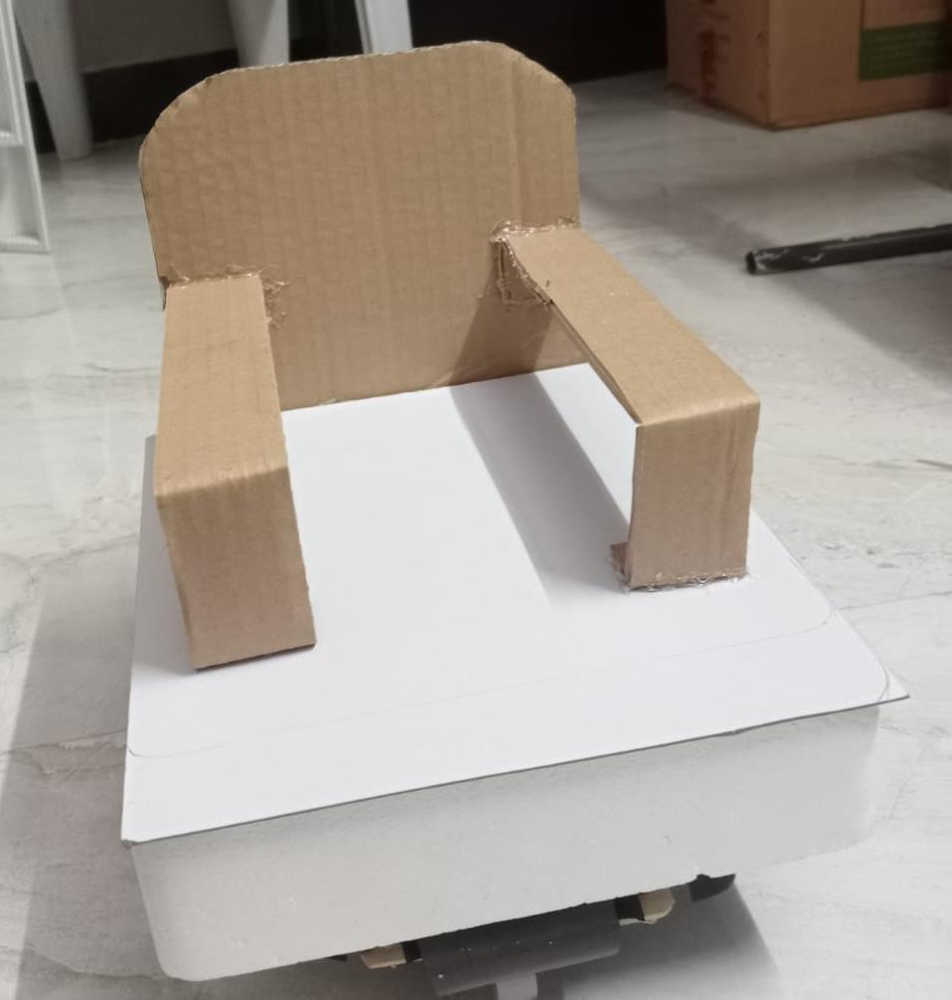

# 🧠 Mind-Controlled Vehicle
### *A Brain-Computer Interface powered smart wheelchair system*

<br>

[](https://python.org)
[](https://arduino.cc)
[](https://numpy.org)
[](https://scikit-learn.org)
[](https://opensource.org/licenses/MIT)

<br>

> **"What if your thoughts could steer the world around you?"**
>
> This project makes that vision real — translating raw brainwaves and eye movements into
> precise, wireless movement commands for an autonomous vehicle. No joystick. No touch. Just mind.

<br>

[](https://somaiya.edu)
&nbsp;
[]()
&nbsp;
[]()
&nbsp;
[]()

</div>

---

## 📌 Table of Contents

| # | Section |
|---|---------|
| 1 | [🌟 Project Abstract](#-project-abstract) |
| 2 | [💡 The Idea Behind It](#-the-idea-behind-it) |
| 3 | [🔬 How It Works — Signal Science](#-how-it-works--signal-science) |
| 4 | [🏗️ System Architecture](#-system-architecture) |
| 5 | [🔌 EEG / EOG Sensing Circuit](#-eeg--eog-sensing-circuit) |
| 6 | [⚙️ Hardware Bill of Materials](#-hardware-bill-of-materials) |
| 7 | [📡 Wheelchair Module](#-wheelchair-module) |
| 8 | [🧩 System Integration](#-system-integration) |
| 9 | [💻 Code Walkthrough](#-code-walkthrough) |
| 10 | [📊 Results & Accuracy](#-results--accuracy) |
| 11 | [🚀 Future Scope](#-future-scope) |
| 12 | [👨‍💻 Team](#-team) |
| 13 | [📚 References](#-references) |

---

## 🌟 Project Abstract

<div align="center">
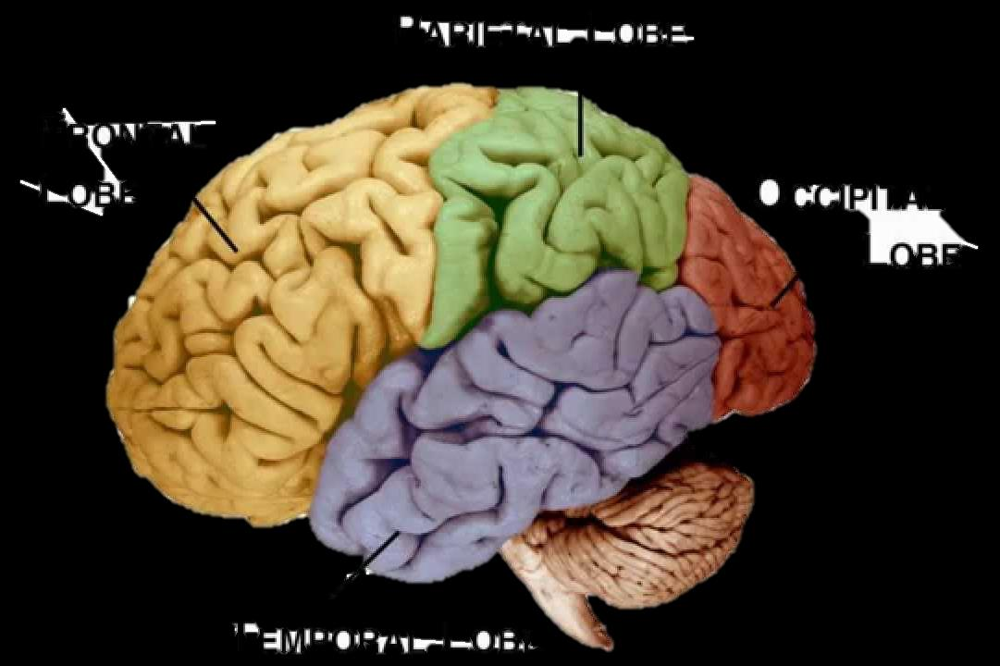
<br><sub><i>Fig. 1 — Regions of the Human Brain</i></sub>
</div>

<br>

**"Brain-Controlled Wheelchair and Beyond"** aims to revolutionize assistive technology by integrating **Brain-Computer Interfaces (BCI)** with smart, wireless vehicle control. 

We developed a sophisticated **EEG + EOG-based control system** that enables precise, real-time commands for a wheelchair — enhancing mobility for individuals with physical disabilities. Through meticulous analysis of brainwave and eye-movement signals, the system seamlessly translates human neural activity into machine action.

**Key Achievements:**
- ✅ **90% accuracy** in detecting focus, eye-closure, and lateral eye movement signals
- ✅ Real-time FFT-based signal classification at **100 samples/second**
- ✅ Wireless BCI-to-vehicle communication via **Bluetooth (HC-05)**
- ✅ Low-cost build at approximately **₹7,000** — democratizing neurotechnology

---

## 💡 The Idea Behind It

The project was born from two converging visions:

> 🦾 **Assistive Independence** — Giving individuals with paralysis or limited mobility the power to move freely without depending on others.

> 🤖 **AI Meets Neuroscience** — Showcasing how Brain-Computer Interfaces (BCI) can bridge human cognition with everyday machines.

The concept came from the **Brain-Computer Interface (BCI)** field. The project doesn't confine itself to wheelchairs. In the future, this very circuit can command:
- 💡 Smart lights, fans, and home appliances
- 🏥 Rehabilitation robotics in hospitals
- 🧠 Emotional/cognitive state monitoring and analysis

**Scope at a Glance:**

| Current Ability | Future Expansion |
|---|---|
| Wheelchair forward / stop | Full home appliance control |
| Eye-gaze lateral steering | Interconnected IoT devices |
| Real-time alpha wave detection | Machine learning intent classification |
| 90% detection accuracy | Emotional & cognitive state analysis |

---

## 🔬 How It Works — Signal Science

### Brainwaves & EEG

The human brain communicates using electrical impulses. These micro-volt level signals (10–100 µV) form distinct **frequency bands**, each tied to a cognitive state:

| Wave Band | Frequency Range | State |
|-----------|----------------|-------|
| **Delta** | 0.5 – 4 Hz | Deep Sleep |
| **Theta** | 4 – 8 Hz | Drowsiness / Meditation |
| **Alpha** | **8 – 13 Hz** | **Eyes Closed / Relaxed** ← *our primary trigger* |
| **Beta** | 13 – 30 Hz | Active / Focused |
| **Gamma** | 30 – 50 Hz | High Concentration |

We exploit **Alpha waves (8–13 Hz)** — which spike when eyes are closed — as the primary **"stop" trigger** for the wheelchair.

### Eye Movements & EOG

The eye acts as an **electric dipole**: the cornea is positive (+), the retina is negative (−). When the eye moves, it generates a measurable electric field. **EOG (Electro-Oculogram)** captures this to detect:

- 👁️‍🗨️ **Gaze Left** → Turn Left
- 👁️ **Gaze Right** → Turn Right

<div align="center">
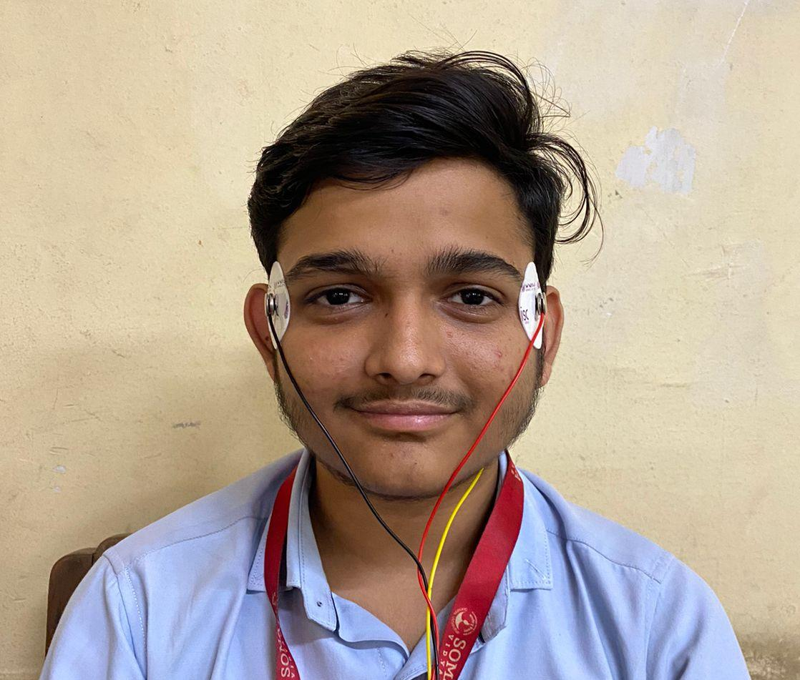
<br><sub><i>Fig. 2 — EOG Electrode Placement on Face</i></sub>
</div>

---

## 🏗️ System Architecture

The entire pipeline from brain → signal → classification → mechanical motion:

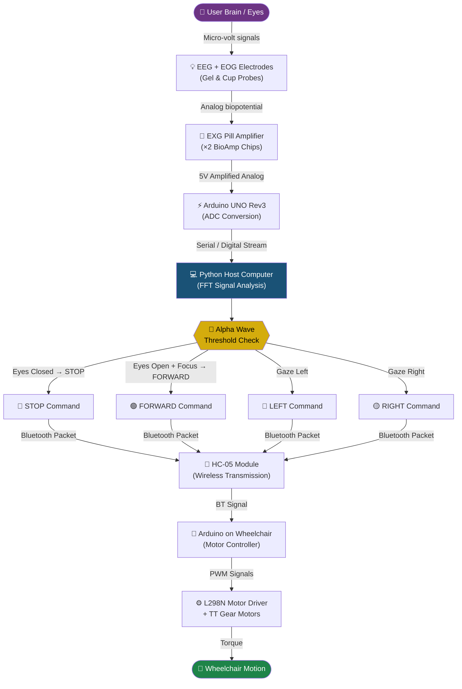
```mermaid
flowchart TD
    A(["🧠 User Brain / Eyes"]) -->|Micro-volt signals| B["💡 EEG + EOG Electrodes\n(Gel & Cup Probes)"]
    B -->|Analog biopotential| C["🔬 EXG Pill Amplifier\n(×2 BioAmp Chips)"]
    C -->|5V Amplified Analog| D["⚡ Arduino UNO Rev3\n(ADC Conversion)"]
    D -->|Serial / Digital Stream| E["💻 Python Host Computer\n(FFT Signal Analysis)"]
    
    E --> F{{"🎯 Alpha Wave\nThreshold Check"}}
    F -->|Eyes Closed → STOP| G["🔴 STOP Command"]
    F -->|Eyes Open + Focus → FORWARD| H["🟢 FORWARD Command"]
    F -->|Gaze Left| I["🔵 LEFT Command"]
    F -->|Gaze Right| J["🟡 RIGHT Command"]
    
    G & H & I & J -->|Bluetooth Packet| K["📡 HC-05 Module\n(Wireless Transmission)"]
    K -->|BT Signal| L["🤖 Arduino on Wheelchair\n(Motor Controller)"]
    L -->|PWM Signals| M["⚙️ L298N Motor Driver\n+ TT Gear Motors"]
    M -->|Torque| N(["🦼 Wheelchair Motion"])
    
    style A fill:#6C3483,color:#fff
    style N fill:#1E8449,color:#fff
    style F fill:#D4AC0D,color:#000
    style E fill:#1A5276,color:#fff
```

---

## 🔌 EEG / EOG Sensing Circuit

<div align="center">
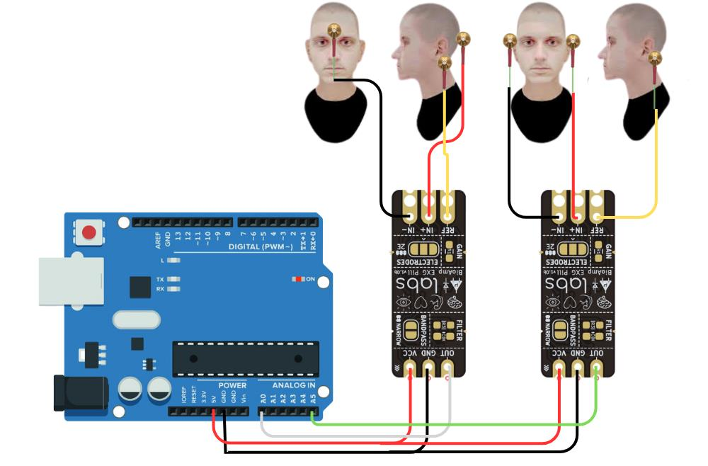
<br><sub><i>Fig. 3 — EEG / EOG Full Circuit Diagram (from Blackbook)</i></sub>
</div>

<br>

The circuit uses **two EXG Pills** operating in tandem:

| EXG Pill #1 — EEG (Brain) | EXG Pill #2 — EOG (Eyes) |
|---|---|
| `+` Positive electrode → **Visual Cortex** | Electrode → **Left eye canthi** |
| `−` Negative electrode → **Frontal Lobe** | Electrode → **Right eye canthi** |
| `REF` Reference → **Behind the Ear** | `REF` Reference → **Behind Ear** |
| Captures: Focus, Relaxation, Eye Closure | Captures: Left/Right eye gaze vectors |

**EXG Pill Specifications:**
- Input Voltage: `4.5 – 40V`
- Input Impedance: `10¹² Ω`
- Biopotentials: ECG, EOG, EMG, EEG (configurable)
- Dimensions: `25.4 × 10.0 mm` — pill-sized!
- Open Source Hardware + Software

<div align="center">

| EXG Pill Pinout | EXG Pill Module | EEG Probes |
|---|---|---|
| 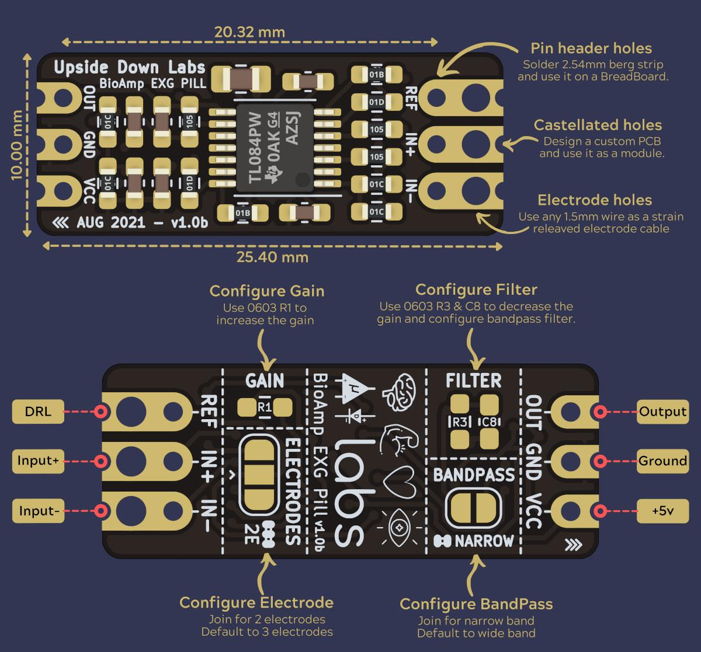 | 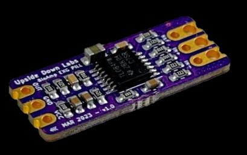 | 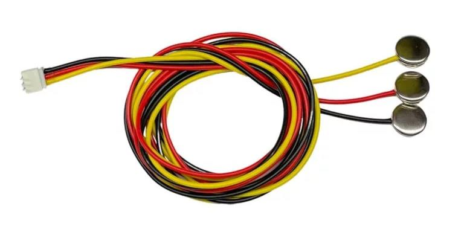 |

| Gel Electrodes | Electrode Gel |
|---|---|
| 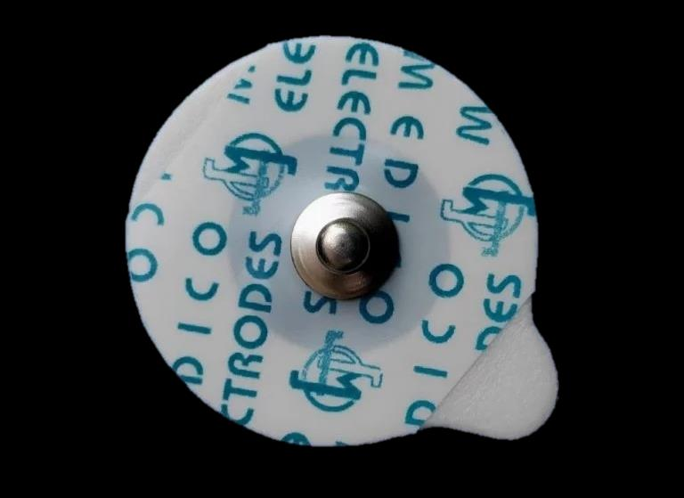 | 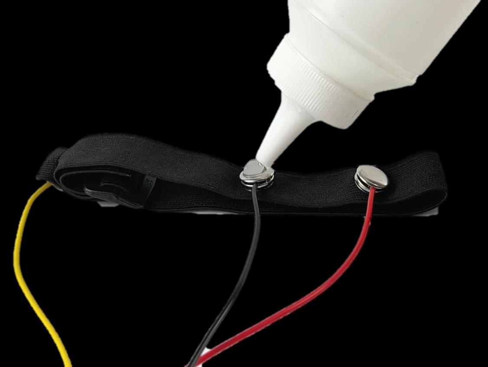 |

</div>

---

## ⚙️ Hardware Bill of Materials

### 🧠 EEG / EOG Sensing Unit

| Sr. | Component | Qty | Purpose |
|-----|-----------|-----|---------|
| 1 | **EXG Pill (BioAmp)** | 2 | Biopotential signal amplification |
| 2 | **Arduino UNO Rev3** | 1 | ADC conversion & serial stream |
| 3 | **EEG Cup Probes** | 3 | Scalp electrode contacts |
| 4 | **Gel Electrodes** | 1 pack | Eye-movement (EOG) detection |
| 5 | **Electrode Gel** | 3 | Low-impedance skin-electrode interface |

### 🦼 Wheelchair / Vehicle Unit

| Sr. | Component | Qty | Purpose |
|-----|-----------|-----|---------|
| 1 | **Arduino UNO Rev3** | 1 | Motor command interpreter |
| 2 | **L298N Motor Controller** | 1 | Dual H-bridge motor driver |
| 3 | **TT Gear DC Motors** | 2 | Wheel drive (3V–6V, compact) |
| 4 | **HC-05 Bluetooth Module** | 1 | Wireless BCI ↔ Wheelchair link |
| 5 | **IR Sensors** | 4 | Obstacle detection & safety stop |
| 6 | **Clear Acrylic Base** | 1 | Chassis frame |
| 7 | **Swivel Wheel** | 1 | Front balance |
| 8 | **6V Battery Holder** | 1 | Motor power supply |
| 9 | **Jumper Cables + Breadboard** | — | Circuit prototyping |

<div align="center">

| Arduino UNO Rev3 | L298N Motor Driver | TT Gear Motors |
|---|---|---|
| 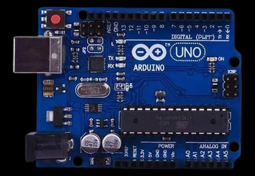 | 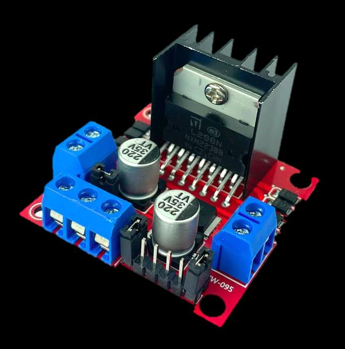 | 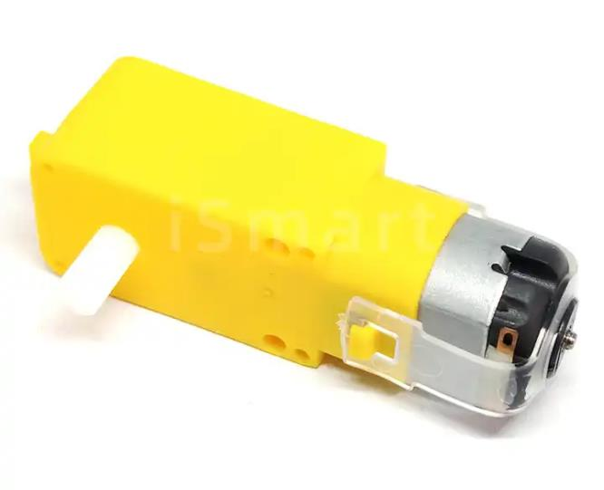 |

| HC-05 Bluetooth | IR Sensor | Breadboard |
|---|---|---|
| 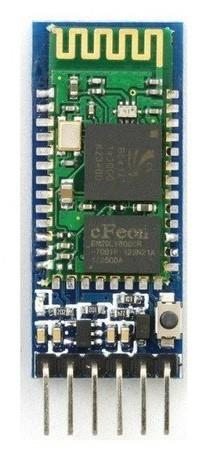 | 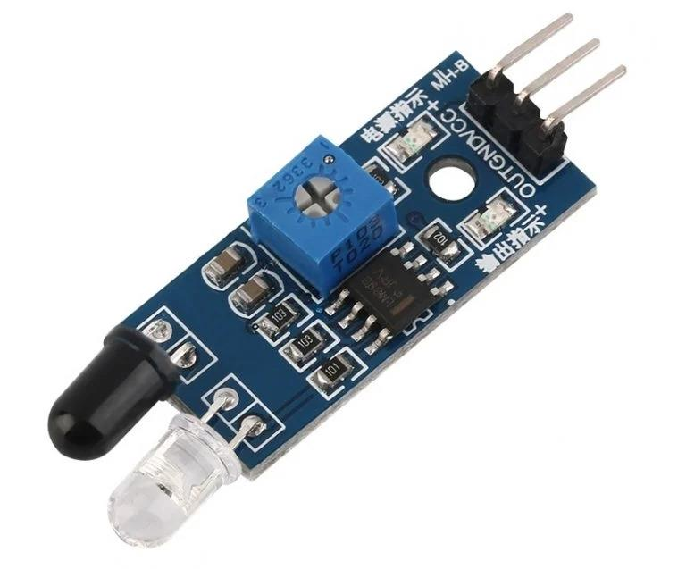 | 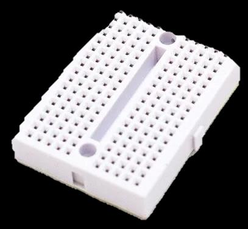 |

</div>

---

## 📡 Wheelchair Module

<div align="center">
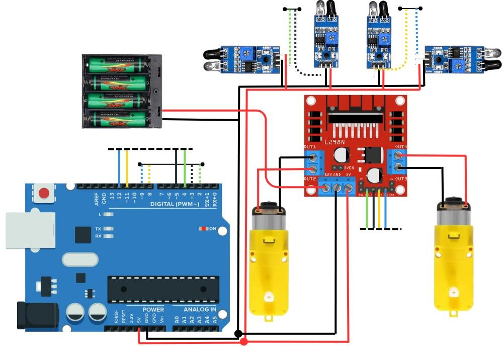
<br><sub><i>Fig. 4 — Wheelchair Chassis Design</i></sub>
</div>

<br>

The wheelchair responds to **4 Bluetooth command tokens** sent from the Python signal processor:

```
'F\n'  →  FORWARD   │  IR Sensors 1&2 active → Obstacle stop
'S\n'  →  STOP      │  Halt both motors immediately
'L\n'  →  LEFT      │  IR Sensor 3 active → Obstacle stop, else turn
'R\n'  →  RIGHT     │  IR Sensor 4 active → Obstacle stop, else turn
```

**Arduino Wheelchair Logic (flowchart):**

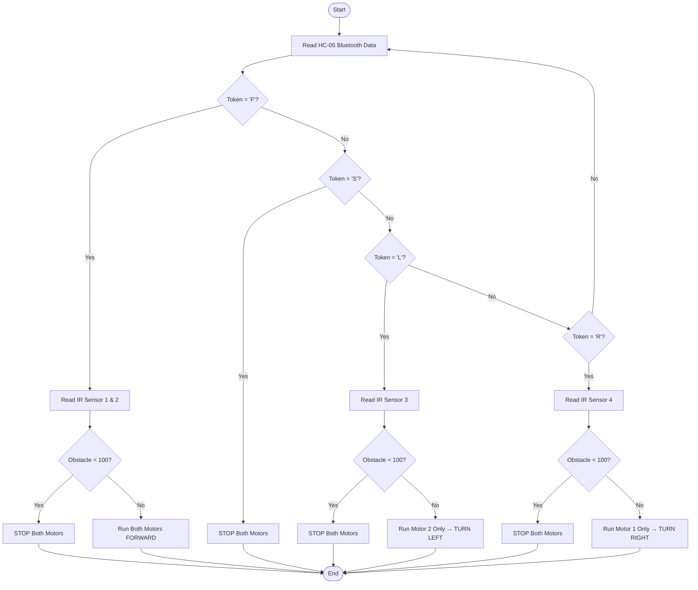
```mermaid
flowchart TD
    S([Start]) --> BT["Read HC-05 Bluetooth Data"]
    BT --> F{"Token = 'F'?"}
    F -->|Yes| IR12["Read IR Sensor 1 & 2"]
    IR12 --> OBS12{Obstacle < 100?}
    OBS12 -->|Yes| STOP1["STOP Both Motors"]
    OBS12 -->|No| FWD["Run Both Motors FORWARD"]
    F -->|No| STP{"Token = 'S'?"}
    STP -->|Yes| STOP2["STOP Both Motors"]
    STP -->|No| LEFT{"Token = 'L'?"}
    LEFT -->|Yes| IR3["Read IR Sensor 3"]
    IR3 --> OBSL{Obstacle < 100?}
    OBSL -->|Yes| STOP3["STOP Both Motors"]
    OBSL -->|No| LFT["Run Motor 2 Only → TURN LEFT"]
    LEFT -->|No| RIGHT{"Token = 'R'?"}
    RIGHT -->|Yes| IR4["Read IR Sensor 4"]
    IR4 --> OBSR{Obstacle < 100?}
    OBSR -->|Yes| STOP4["STOP Both Motors"]
    OBSR -->|No| RGT["Run Motor 1 Only → TURN RIGHT"]
    RIGHT -->|No| BT
    STOP1 & STOP2 & STOP3 & STOP4 & FWD & LFT & RGT --> E([End])
```

<div align="center">
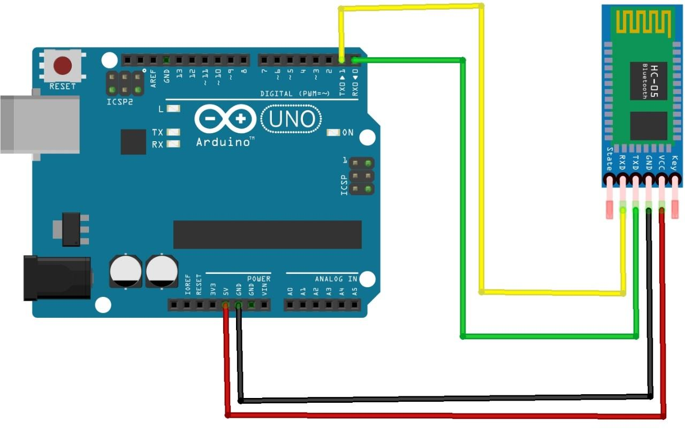
<br><sub><i>Fig. 5 — HC-05 Bluetooth Connection to Arduino</i></sub>
</div>

---

## 🧩 System Integration

The project weaves together **neurotechnology and robotics** in 4 precise steps:

<div align="center">

```
┌─────────────────────────────────────────────────────────────────────┐
│                     SYSTEM INTEGRATION FLOW                        │
├────────────┬────────────┬────────────┬────────────────────────────┤
│  STEP 1    │  STEP 2    │  STEP 3    │  STEP 4                    │
│            │            │            │                            │
│  EEG/EOG   │  Python    │  Arduino   │  Seamless User             │
│  Data      │  FFT       │  Wireless  │  Experience                │
│  Capture   │  Analysis  │  Control   │                            │
│            │            │            │                            │
│  Electrodes│ Frequency  │  HC-05 BT  │  User focuses →            │
│  → EXG     │  Band      │  command   │  Wheelchair moves          │
│  Pill →    │  isolation │  broadcast │  Eyes close →              │
│  Arduino   │  & intent  │  to motor  │  Vehicle stops             │
│  → Serial  │  mapping   │  Arduino   │  Gaze shifts →             │
│  Stream    │            │            │  Turns accordingly         │
└────────────┴────────────┴────────────┴────────────────────────────┘
```

</div>

<div align="center">

| Step 1: EEG/EOG Data Collection | Step 2: FFT Data Processing |
|---|---|
| 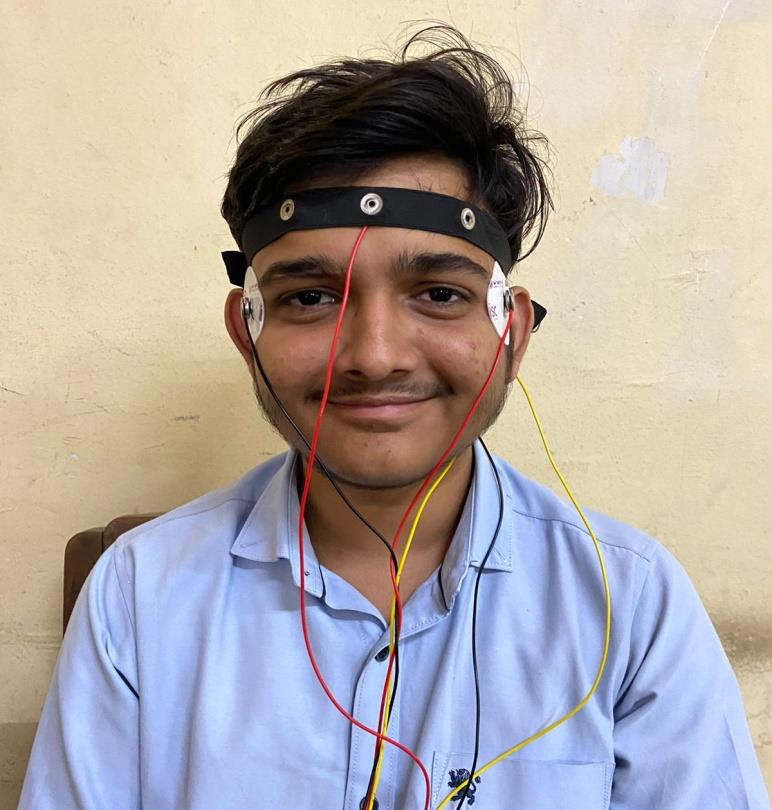 | 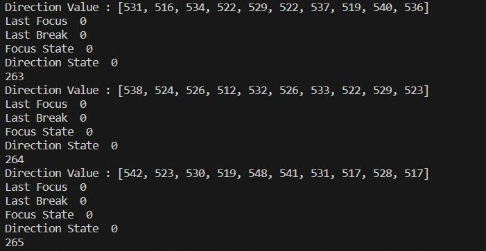 |

| Step 3: Arduino Wheelchair Unit | Step 4: Fully Integrated System |
|---|---|
|  | 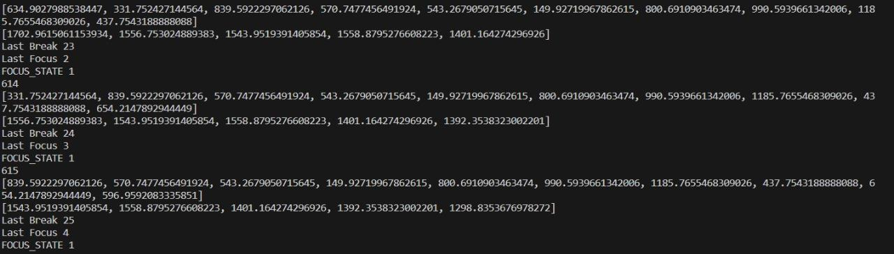 |

</div>

---

## 💻 Code Walkthrough

### 📂 Repository Structure

```
Mind-Controlled-Vehicle/
│
├── 🧠 brain_info.py          ← Core EEG/EOG signal reader + FFT classifier
├── 🔄 run.py                 ← Entry point: serial connection & live data stream
├── 🔄 run2.py                ← FFT peak analysis with scipy.signal
├── 📊 plot.py                ← EEG waveform visualization tool
├── 🤖 model.py               ← Sklearn Linear Regression model training
├── 👁️ eyes_closed.py         ← Standalone eye-state detector
├── 🧪 test_sample.py         ← Sample data testing
├── 🧪 test_binary_data.py    ← Binary data stream validation
├── 📈 AdruinoData2.csv       ← Raw Arduino voltage dataset
├── 📁 trained_model.pkl      ← Pre-trained voltage regression model
├── 📁 eeg_data/              ← Collected EEG/EOG session CSVs
└── 📁 Brain-master/          ← Supporting BCI library
```

### ⚡ Core FFT Alpha Wave Detection (`brain_info.py`)

```python
# Sampling at 100 Hz, sliding window of 100 samples
fs = 100
threshold_freq = 700   # Alpha magnitude threshold for eye-close detection

# Sliding window: pop 10 old samples, push 10 new
eeg_data = eeg_data[10:]
for y in range(10):
    bytes = serialInst.read(2)
    eeg_data.append(int(bytes[0] + (bytes[1] << 8)))

# Fast Fourier Transform
fft_result = np.fft.fft(eeg_data)
frequencies = np.fft.fftfreq(len(eeg_data), 1/fs)

# Alpha Band: 8–9 Hz (Low Alpha) — Primary trigger
mask = (frequencies >= 8) & (frequencies <= 9)
filtered = fft_result[mask]
lowAlpha = np.mean(np.abs(filtered))

# Decision: rolling window of 5 readings
light.append(lowAlpha)
if len(light) > 5: light.pop(0)

if all(x > threshold_freq for x in light):
    ledState = "XXXXXX"   # 👁️ Eyes CLOSED → STOP wheelchair
else:
    ledState = "OOOOOO"   # 👁️ Eyes OPEN  → Continue
```

### 📡 Frequency Bands Extracted

| Band | Frequency Range | Variable |
|------|----------------|----------|
| Low Alpha | 8 – 9 Hz | `lowAlpha` ← **Primary trigger** |
| High Alpha | 10 – 12 Hz | `highAlpha` |
| Low Beta | 13 – 17 Hz | `lowBeta` |
| High Beta | 18 – 30 Hz | `highBeta` |
| Low Gamma | 30 – 40 Hz | `lowGamma` |
| High Gamma | 31 – 49 Hz | `highGamma` |

### 🎓 ML Model (`model.py`)

```python
# Linear Regression: maps raw digital values → calibrated voltages
import pandas as pd, joblib
from sklearn.linear_model import LinearRegression
from sklearn.model_selection import train_test_split

df = pd.read_csv('AdruinoData2.csv', encoding='ISO-8859-1').dropna()
X, y = df[['dvalue']], df[['voltage']]

Xtrain, Xtest, ytrain, ytest = train_test_split(X, y, test_size=0.2, random_state=42)
model = LinearRegression().fit(Xtrain, ytrain)
joblib.dump(model, 'trained_model.pkl')
```

---

## 📊 Results & Accuracy

<div align="center">

```
╔══════════════════════════════════════════════════════════════╗
║                  PERFORMANCE METRICS                        ║
╠═══════════════════════════╦══════════════════════════════════╣
║  Metric                   ║  Result                         ║
╠═══════════════════════════╬══════════════════════════════════╣
║  FFT Detection Accuracy   ║  🟢  90%                        ║
║  Sampling Rate            ║  🟢  100 samples/sec            ║
║  System Cost              ║  🟢  ₹7,000 (~$85 USD)         ║
║  Control Latency          ║  🟢  Real-time (< 500ms)        ║
║  Wireless Range (HC-05)   ║  🟢  ~10 meters                 ║
║  Supported Signals        ║  🟢  EEG + EOG Dual-channel     ║
╚═══════════════════════════╩══════════════════════════════════╝
```

</div>

**FFT Signal Analysis — Visual Outputs:**

<div align="center">

| FFT — Normal State | FFT — Sudden Awake State |
|---|---|
| 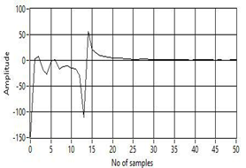 | 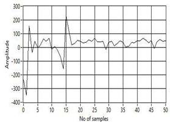 |

| Real-Time EEG Data Stream |
|---|
| 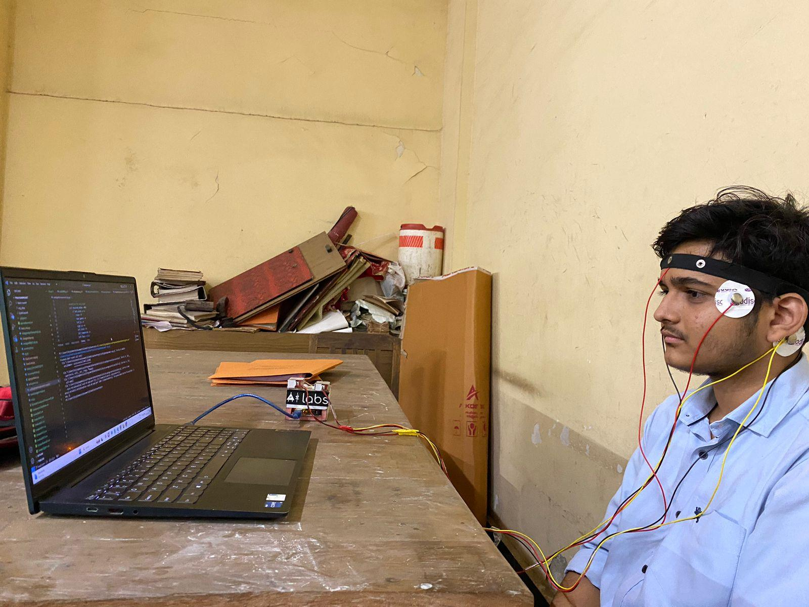 |

</div>

---

## ⚙️ Setup & Installation

### Prerequisites

```bash
pip install numpy scipy matplotlib pyserial scikit-learn tensorflow joblib
```

### Running the BCI Signal Processor

1. **Connect** the EXG Pill → Arduino → USB to your laptop.
2. **Pair** the HC-05 Bluetooth module (default PIN: `1234`).
3. **Configure** your COM port inside `brain_info.py`:
   ```python
   serialInst.port = "COM3"      # 🔧 Change to your port
   serialInst.baudrate = 500000
   ```
4. **Launch** the signal reader:
   ```bash
   python brain_info.py
   ```
5. **Monitor** the console:
   ```
   OOOOOO  →  Eyes OPEN   (vehicle continues)
   XXXXXX  →  Eyes CLOSED (vehicle stops)
   ```

### 💡 Reading the Output CSV

The program writes session data to a timestamped CSV with columns:

```
Timestamp | Iterations | LowAlpha | LowAlphaPhase | HighAlpha | HighAlphaPhase |
LowBeta | LowBetaPhase | HighBeta | HighBetaPhase | LowGamma | LowGammaPhase |
HighGamma | HighGammaPhase | EyeStatus
```

---

## 🚀 Future Scope

```
🔮  TODAY                         →     🌐  TOMORROW
─────────────────────────────────────────────────────────────
Wheelchair movement                →  Full home appliance control
Eye-gaze steering                  →  Smart city device interaction
Rule-based alpha thresholds        →  ML intent classifiers (LSTM / CNN)
Prototype chassis                  →  Medical-grade wheelchair hardware
EEG/EOG signals only               →  EMG + multi-modal BCI fusion
Focus-based commands               →  Emotional & cognitive state analysis
1 user profile                     →  Personalized adaptive user models
```

The future roadmap envisions:
- 🤖 **Machine Learning integration** — Deep learning models trained on extensive EEG datasets for hyper-personalized control
- 🏠 **Smart Home BCI** — Control lights, fans, TVs with pure thought
- 🧠 **Cognitive Analysis** — Mental health monitoring and neuroscientific research applications
- 🌍 **Global Accessibility** — Open-source platform to democratize neurotechnology worldwide

---

## 👨‍💻 Team

<div align="center">

This project was developed at **K. J. Somaiya Polytechnic**, Department of Computer Engineering, Mumbai — 2023–2024.

| Name | Roll No. | Role |
|------|----------|------|
| **Apurva Khangal** | FCOG21723 | BCI Research & Signal Processing |
| **Swayam Patel** | FCOG21738 | Wheelchair Hardware & Integration |
| **Vedant Shetye** | FCOG21749 | Arduino Programming & Testing |

**Project Guide:** Mrs. Rupali Patil
**H.O.D.:** Mrs. Charulata Ingle
**Principal:** Mrs. Padmaja Bhanu

</div>

---

## 📚 References

1. [BCI: EEG Processing Device to Control Wheelchair Using Thoughts — ResearchGate](https://www.researchgate.net/publication/362945887)
2. [Frontiers in Neuroscience — BCI Review](https://www.frontiersin.org/articles/10.3389/fnins.2019.01068/full)
3. [University of Arkansas — EEG Research](https://scholarworks.uark.edu/cgi/viewcontent.cgi?article=1027&context=eleguht)
4. [DIY EEG and ECG Circuit — Instructables](https://www.instructables.com/DIY-EEG-and-ECG-Circuit/)
5. Amod Kumar et al., *"Denoising EEG Signals Using Digital Signal Processor"*, IJCA, 2014
6. Anastasios E. et al., *"Simulated EEG Signals: EMD, Wavelet & Kalman Filter Comparison"*, IEEE, 2013
7. Arden GB et al., *"A new clinical test of retinal function based upon the standing potential of the eye"*, 1962
8. Kemalasari & Purnomo, *"Brain Activity in Frontal Lobe Using K-means"*, IEEE, 2010
9. Di Xiao & Zhang, *"EEG Based Brain Concentration HCI"*, IEEE Transactions on Biomedical Engineering, 2015
10. [Arduino Official Documentation](http://arduino.cc/en/Main/ArduinoBoardUno)

---

<div align="center">

**Made with 🧠 + ❤️ at K. J. Somaiya Polytechnic, Mumbai**

*"Technology should understand everyone — and make life better for all of us."*

<br>

[](https://github.com/SWAYAMPATEL30/Mind-Controlled-Vehicle)

</div>
